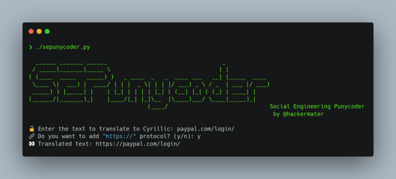

# SEPunycoder.py

## SEPunycoder - Social Engineering Punycoder (by hackermater)

A simple script to convert normal-text to Cyrillic-text. This allows hackers to obfuscate text in puny-code format which can lead to a lot of multiple Phishing attacks.

# ⭐ Preview



- Code Snippet

```bash
$: ./sepunycoder.py

  ______ _______ ______                                  _
 / _____|_______|_____ \                                | |
( (____  _____   _____) )   _ ____  _   _  ____ ___   __| |_____  ____
 \____ \|  ___) |  ____/ | | |  _ \| | | |/ ___) _ \ / _  | ___ |/ ___)
 _____) ) |_____| |    | |_| | | | | |_| ( (__| |_| ( (_| | ____| |
(______/|_______)_|    |____/|_| |_|\__  |\____)___/ \____|_____)_|
                                   (____/                              Social Engineering Punycoder
                                                                        by @hackermater

🔓 Enter the text to translate to Cyrillic: paypal.com/login
🔗 Do you want to add "https://" protocol? (y/n): y
👀 Translated text: https://раураl.соm/lоgin
```

## ⚠️ DISCLAIMER

This repository is intended for educational purposes only. 

The scripts provided are meant to demonstrate social engineering techniques and should not be used for any malicious or unethical activities.

The author does not condone or support any illegal or unethical use of the information or tools provided in this repository.

Any actions taken by individuals using the scripts in this repository are their own responsibility.

The author is not liable for any misuse of the content within this repository.

Users are advised to use the scripts responsibly and in compliance with all applicable laws and regulations.

Thank you for your understanding and commitment to responsible use of the resources provided.
