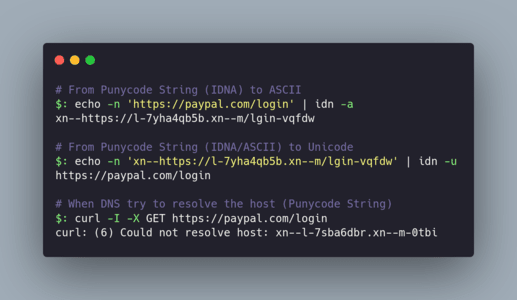

# SEPunycoder.py

## SEPunycoder - Social Engineering Punycoder (by hackermater)

A simple script to convert normal-text to Cyrillic-text. This allows hackers to obfuscate text in puny-code format which can lead to a lot of multiple Phishing attacks.

# ⭐ Preview


- Code Snippet

```bash
$: ./sepunycoder.py

  ______ _______ ______                                  _
 / _____|_______|_____ \                                | |
( (____  _____   _____) )   _ ____  _   _  ____ ___   __| |_____  ____
 \____ \|  ___) |  ____/ | | |  _ \| | | |/ ___) _ \ / _  | ___ |/ ___)
 _____) ) |_____| |    | |_| | | | | |_| ( (__| |_| ( (_| | ____| |
(______/|_______)_|    |____/|_| |_|\__  |\____)___/ \____|_____)_|
                                   (____/                              Social Engineering Punycoder
                                                                        by @hackermater

🔓 Enter the text to translate to Cyrillic: paypal.com/login
🔗 Do you want to add "https://" protocol? (y/n): y
👀 Translated text: https://раураl.соm/lоgin
```

# 🎯 Proof of Concept - Demonstration



- Code Snippet

```bash
# From Punycode String (IDNA) to ASCII
$: echo -n 'https://раураl.соm/lоgin' | idn -a
xn--https://l-7yha4qb5b.xn--m/lgin-vqfdw

# From Punycode String (IDNA/ASCII) to Unicode
$: echo -n 'xn--https://l-7yha4qb5b.xn--m/lgin-vqfdw' | idn -u
https://раураl.соm/lоgin

# When DNS try to resolve the host (Punycode String)
$: curl -I -X GET https://раураl.соm/lоgin
curl: (6) Could not resolve host: xn--l-7sba6dbr.xn--m-0tbi
```

+ Useful Documentation: [https://www.icann.org/resources/pages/idn-2012-02-25-en](https://www.icann.org/resources/pages/idn-2012-02-25-en)
+ Note: `idn` command is from [Libidn](https://www.gnu.org/software/libidn/)

# 🤺 Utility in Social Engineering

> "Punycode is a way to represent Unicode with the limited character subset of ASCII supported by the Domain Name System (DNS)".

Therefore this tool can be used for Social Engineering Attacks in the following scenarios:

- Email Spoofing: Crafting email addresses that closely mimic those of trusted individuals or organizations using Punycode.

- Fake Website Creation: Register domain names containing Punycode characters to replicate well-known websites.

- Social Media Impersonation: Creation of Social Media profiles that impersonate genuine individuals or organizations.

- Phishing campaigns: Generate phishing links with Punycode-encoded domain names so that victim click on seemingly authentic links.

## ⚠️ DISCLAIMER

This repository is intended for educational purposes only. 

The scripts provided are meant to demonstrate social engineering techniques and should not be used for any malicious or unethical activities.

The author does not condone or support any illegal or unethical use of the information or tools provided in this repository.

Any actions taken by individuals using the scripts in this repository are their own responsibility.

The author is not liable for any misuse of the content within this repository.

Users are advised to use the scripts responsibly and in compliance with all applicable laws and regulations.

Thank you for your understanding and commitment to responsible use of the resources provided.

## 🧡 Support me with a virtual Coffee! 🧡

<a href='https://ko-fi.com/L4L5Z62NT' target='_blank'></a>
